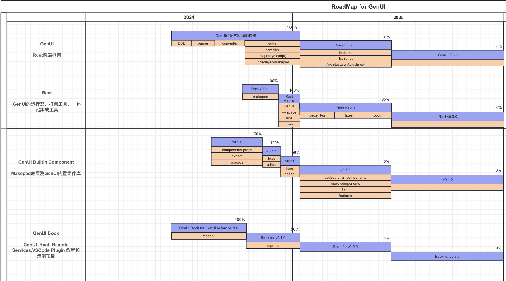
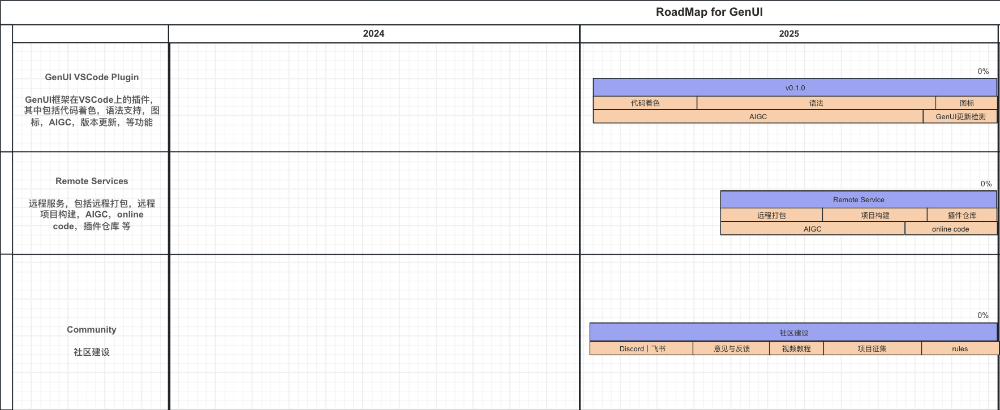

  
  <h1 style="color: #FF7053;">GenUI</h1>
  <strong>
    An innovative SFP Rust front-end framework
  </strong>
  

  

    
    
    
    
  

## Introduction

**GenUI is an innovative SFP front-end framework developed in the Rust language, was originally inspired by Vue3 and Makepad. Intended to help users write front-end projects using Rust more efficiently.**

> [!IMPORTANT] 
>
> The stable branch is `main`
> 
> The current work branch is `dev_${version}`

## How to learn

You can read [GenUI Book](https://privoce.github.io/GenUI.github.io/gen/introduction.html) to learn

If you have any questions or need further assistance, please feel free to consult the relevant documentation or contact us

## RoadMap

## Features

- [x] Book for GenUI
- [x] the entire set of GenUI and other syntax design
- [x] the underlying Makepad encoding conversion and compiler
- [x] dynamic script embedding (plug-in capability)
- [x] Rust script processing: 
  - [x] two-way binding
  - [x] component events
  - [x] component import
  - [x] component definition
  - [x] prop definition
  - [x] event definition
  - [x] network (http)
  - [x] lifecycle
    - [x] before_mount
    - [x] mounted
    - [x] before_update
    - [x] updated
  - [x] computed
- [x] Integrate Basic GenUI Builtin Components
- [x] Ract Cli support
- [x] Built-in syntax sugar
  - [x] for
  - [x] if_else_if_else
- [ ] Integrate all Builtin Components (70%)
- [x] Optimize static compilation
- [ ] Powerful Scss like `<style>`
- [x] Self-Close component tag
- [x] Powerful Bind
- [ ] VSCode Plugin
- [ ] Remote Services

## Releases

- [GenUI](https://github.com/Privoce/GenUI/releases/tag/v0.1.0)
- [Ract](https://github.com/Privoce/ract/releases/tag/v0.1.1)
- [GenUI Builtin Component](https://github.com/Privoce/GenUI-Builtin-Component/releases/tag/v0.2.0)
- [GenUI Book](https://privoce.github.io/GenUI.github.io/index)

## Collaboration and Feedback
> [!IMPORTANT]
> GenUI is currently in the early stages of development, with many features still being planned and implemented. We welcome community feedback and collaboration! If you have any suggestions for the framework, need to report an issue, or would like to add features, please contact us through the following channels:

- **GitHub**: [https://github.com/Privoce/GenUI](https://github.com/Privoce/GenUI)
- **Discord**: [https://discord.gg/jVEJDhE75Y](https://discord.gg/jVEJDhE75Y)
- **Email**: [syf20020816@outlook.com](mailto:syf20020816@outlook.com)
- **Collaboration Email**: [han@privoce.com](mailto:han@privoce.com)

Thank you for your support, and we look forward to building a better GenUI with you!
