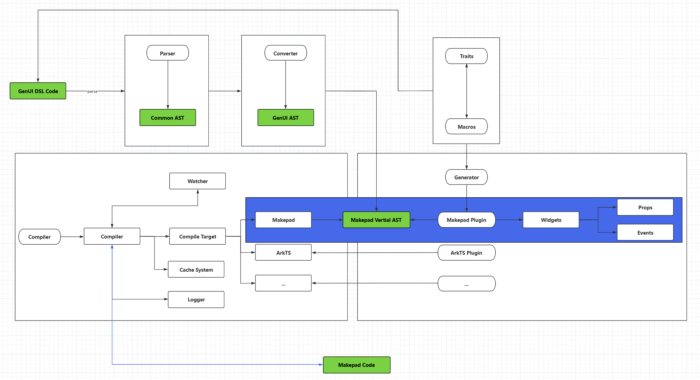

# README

The current work branch is `combine`

## Work Description

| Dir          | des                                      |
| ------------ | ---------------------------------------- |
|examples|GenUI Example(Working)|
|gen|the finally framework dir(Comming Soon)|
|gen-ui|work dir(Working)|
|wiki|GenUI wiki(Comming Soon)|

- [x] Compiler
- [x] Parser
- [x] Converter
- [ ] Traits
- [ ] Macros
- [ ] Generator
  - [x] Makepad Plugin
  - [ ] Other Plugin
- [ ] GenUI VSCode Plugin
- [x] GenUI Makepad Unified Widget Lib
- [x] [Makepad Book](https://palpus-rs.github.io/Gen-UI.github.io/)

## Features

### Makepad

- [x] Makepad Compiler
- [x] static page
- [x] ArkUI Template
- [ ] dyn widget (half support, now working...)
- [x] wasm
- [x] GenUI Builtin-Widget (working...)
- [x] rust lang support (use in .gen file, hold in `<script lang="rust">` or `<script>`)
- [x] Shader
- [x] Toml Config

#### Widgets
- [x] Window
- [x] View
- [x] Button (todo!(button other event, click event finish))
- [x] Icon
- [x] Label 
- [x] Image
- [x] RotatedImage
- [x] Radio
- [x] Checkbox
- [x] ScrollXYView
- [x] ScrollXView
- [x] ScrollYView
- [x] SolidView
- [x] RectView
- [x] RectShadowView
- [x] RoundedView
- [x] RoundedShadowView
- [x] TextInput
- [x] DropDown
- [x] LinkLabel
- [x] FoldButton
- [x] Slider
- [x] SliderBig
- [x] Slide
  - [x] SlidesView
  - [x] SlideBody
  - [x] SlideChapter
- [x] FoldHeader
- [x] Html
- [x] Markdown
- [x] ScrollBar
- [x] ScrollBars
- [x] DesktopButton
- [x] Splitter
- [ ] Dock
- [ ] Nav

#### Props

- [x] animation
- [x] as_prop (WidgetRef)
- [x] Draw
- [x] Color
  - [x] hex
  - [x] linear
  - [x] radial
  - [x] rgb
  - [x] rgba
  - [x] shader 

#### Control

- [x] for
- [x] if_else
## Architecture

## DSL Design

## Syntax Match

